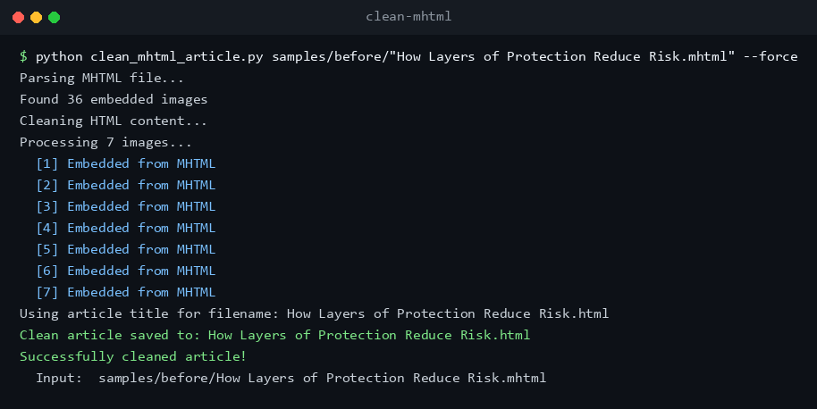
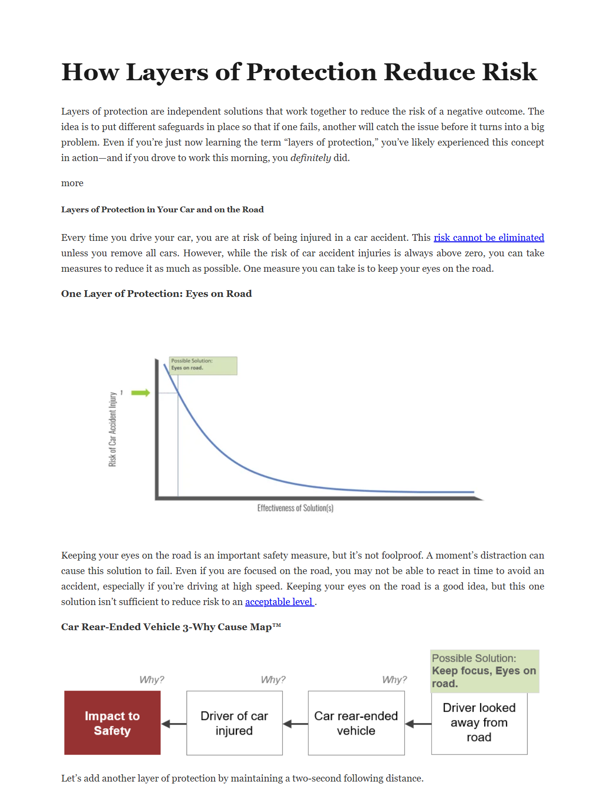

# MHTML Article Cleaner

> CLI that extracts clean, readable article content from MHTML files — strips nav/ads/chrome, embeds images as data URIs, offline by default.

[](LICENSE)
[](https://www.python.org/)
[](https://github.com/Steve-Sexton/mhtml-article-cleaner)

A Python utility to extract clean article content from MHTML files, removing navigation, headers, footers, ads, and other extraneous elements while preserving article text, images, title, and formatting.

## Features

- **Automatic Content Detection**: Intelligently identifies article content using multiple strategies (post-body, blog-content, article tags, etc.)
- **Embedded Image Support**: Extracts and embeds images already present in MHTML files (via Content-ID and Content-Location)
- **Lazy-Load Aware**: Resolves images that stash their real URL in `data-src`/`data-lazy-src`/`data-original`/`srcset` behind an empty or placeholder `src`
- **Opt-in Image Downloading**: `--download-missing` downloads images not already in the MHTML and embeds them as base64 data URIs
- **Offline by Default**: No network requests are made unless you explicitly enable them
- **SSRF Guard**: When downloading, refuses hosts that resolve to private, loopback, link-local, or otherwise reserved addresses (e.g. `localhost`, `10.x`, the `169.254.169.254` cloud-metadata endpoint)
- **Overwrite Protection**: Refuses to clobber an existing output file unless `--force` is passed
- **Clean Formatting**: Removes inline styles, classes, and IDs while maintaining semantic HTML structure
- **Professional Styling**: Applies clean, readable typography and layout
- **HubSpot Blog Support**: Specifically handles HubSpot blog structure

## Requirements

- Python 3.9+
- BeautifulSoup4

Install dependencies with:

```bash
pip install -r requirements.txt
```

Or install the package itself (exposes a `clean-mhtml` console script):

```bash
pip install .
```

## Usage



### Basic usage (filename derived from title)

```bash
python clean_mhtml_article.py input.mhtml
```

The output filename is derived from the article's title (e.g. `How Layers of Protection Reduce Risk.html`).

### Custom filename

```bash
python clean_mhtml_article.py input.mhtml custom_output.html
```

### Batch (all `.mhtml` files in a folder)

PowerShell:

```powershell
Get-ChildItem -Filter *.mhtml | ForEach-Object {
    python clean_mhtml_article.py --force $_.FullName
}
```

Add `-Recurse` to descend into subfolders, or `-Path "C:\path\to\mhtmls"` to
target a different directory. Drop `--force` if you want the script to refuse
to overwrite existing outputs.

Bash:

```bash
for f in *.mhtml; do python clean_mhtml_article.py --force "$f"; done
```

### Flags

| Flag | Purpose |
| --- | --- |
| `--download-missing` | Fetch images referenced by `http(s)://` URLs that are not embedded in the MHTML, and inline them as base64 data URIs. Off by default. Each download is capped at `MAX_DOWNLOAD_BYTES` (20 MB) and uses a `DOWNLOAD_TIMEOUT_SECONDS` (10 s) socket timeout; on cap or failure the original URL is kept unchanged. |
| `--force` | Overwrite the output file if it already exists. |
| `--quiet` / `--verbose` | Suppress progress output (only warnings/errors) or add debug-level detail. Mutually exclusive. |

### Exit codes

| Code | Meaning |
| --- | --- |
| `0` | Success |
| `1` | Unexpected error (traceback printed) |
| `2` | Output file already exists (use `--force`) |
| `3` | MHTML boundary marker missing or unrecognized |
| `4` | No recognizable article content in the input HTML |

## How It Works

1. **Parse MHTML**: Extracts HTML content and embedded images from the MHTML container.
   - Accepts both quoted and unquoted boundary markers.
   - Handles CRLF and LF part separators.
   - Decodes base64 and quoted-printable encodings.
   - Collects embedded images by `Content-ID` and `Content-Location`.
2. **Find Article Content**: Uses a cascade of strategies to locate the main article:
   - HubSpot `post-body` class
   - `data-widget-type="blog_content"`
   - `<article>` tag
   - Generic content classes (`post-body`, `blog-content`, `article-body`, `entry-content`, `post-content`)
   - `<main>` or an id matching `main|content|article`
   - Largest `<div>` by text length (fallback)
3. **Process Images**:
   - Images that hide their real source in a lazy-load attribute (`data-src`, `data-lazy-src`, `data-original`, or the first `srcset` candidate) behind an empty or `data:` placeholder `src` are resolved to the real URL first.
   - Embedded `cid:` references are replaced with the corresponding embedded image.
   - External URLs already present in the MHTML (keyed by Content-Location) are embedded.
   - With `--download-missing`, remaining external URLs are fetched over `http`/`https` (other schemes are refused) and embedded. Before any connection is opened, the host is resolved and rejected if it maps to a private, loopback, link-local, or reserved address (SSRF guard); the original URL is then kept unchanged.
   - All embedded images are converted to base64 data URIs with MIME type sniffed from magic bytes; images whose bytes do not match a known signature (JPEG, PNG, GIF, WebP) are left with their original `src` reference and a warning is logged rather than being silently wrapped in a guessed MIME type.
4. **Clean Content**: Removes scripts, `noscript`, comments, social sharing, related-posts, subscribe blocks, and inline `style`/`class`/`id`/`data-*` attributes.
5. **Style and Format**: Applies a small built-in stylesheet optimized for reading.
6. **Export**: Writes a single standalone HTML file.

## Output

The cleaned, standalone HTML rendered in a browser — title, body text, and the article's images embedded inline, with the surrounding site chrome stripped:



- Title extracted from `<title>` (or first `<h1>` as fallback) and rendered as a top-level `<h1>`.
- All paragraphs, headings, lists, and blockquotes preserved.
- Embedded images inline as base64 data URIs (if they were present in the MHTML, or if `--download-missing` was used).
- Clean HTML structure with semantic tags and a built-in stylesheet.

## Code Structure

### Module-level helpers

- `sanitize_filename(title, max_length=100, extension='.html')` — produces a safe cross-platform filename. Strips invalid Windows characters, collapses whitespace, respects `max_length` including the extension, and prefixes Windows reserved device names (`CON`, `PRN`, `NUL`, `COM1`–`COM9`, `LPT1`–`LPT9`) with `_`.
- `detect_image_mime(data)` — single source of truth for MIME detection from magic bytes.
- `mime_from_url_suffix(url)` — MIME type from the URL's extension.

### `MHTMLCleaner` class

- `parse_mhtml()` — extracts the largest HTML part and all embedded images.
- `download_and_encode_image(url)` — downloads an `http(s)` URL and returns a data URI (or the original URL on failure).
- `clean_html(html, images)` — orchestrates the cleaning pipeline. Delegates to small private helpers:
  - `_find_article_root`
  - `_strip_noise_selectors`
  - `_resolve_images`
  - `_strip_attributes`
  - `_extract_title`
  - `_build_output_document`
- `process(output_path=None, force=False)` — end-to-end pipeline, writes to disk.

The `downloader` callable is dependency-injectable via the `MHTMLCleaner(..., downloader=...)` constructor argument, which is used by the test suite to avoid any real network I/O.

## Testing

```bash
pip install -r requirements-dev.txt
pytest
```

The test suite covers:

- `sanitize_filename` boundary cases (empty, whitespace, invalid characters, Windows reserved names, length truncation)
- MHTML boundary parsing (quoted, unquoted, missing, LF-only separators, malformed base64)
- Content-ID and Content-Location image extraction
- Largest-HTML-part selection
- The `article_content.children` snapshot regression (prevents sibling drop-out during tree move)
- Offline-by-default behavior (no network calls without `--download-missing`)
- Overwrite protection, `--force`, and CLI exit codes
- `file://` / `ftp://` scheme refusal

## Customization

- **Styling**: modify the `_STYLESHEET` constant in `clean_mhtml_article.py`.
- **Noise selectors**: edit the list in `MHTMLCleaner._strip_noise_selectors`.
- **Content detection**: add strategies to `MHTMLCleaner._find_article_root`.

## Troubleshooting

**No content found**: the CLI prints an error to stderr, does not write an output file, and exits with code `4`. Add a platform-specific detector to `_find_article_root` for the affected source, then re-run.

**External images not embedded**: pass `--download-missing` to fetch URLs not already embedded in the MHTML. Without the flag, external URLs are kept verbatim.

**Output already exists**: pass `--force`. Without it, the CLI exits with code `2` and does not write.

**MHTML boundary error**: the file's boundary marker is unrecognized; the CLI exits with code `3`. This can happen if the file is not a multipart MIME document.

## Output details

- Title is extracted from `<title>` (or the first `<h1>` as fallback) and rendered as a top-level `<h1>`. If the article body already contains an `<h1>` whose text matches the extracted title, the duplicate is removed so the output has exactly one title heading.
- Noise elements are matched by **whole CSS class token** against an explicit allowlist (see `_NOISE_EXACT_TOKENS` in `clean_mhtml_article.py`). Substring matches are intentionally avoided so that content classes like `authoritative-source`, `share-of-voice`, `related-work-citation`, or `subscriber-only-content` are preserved.
- The `<main>`/`id=...` fallback matches `main`, `content`, `article` only on whole-token boundaries (e.g. `main-content`, `article-body`). Ids like `mainstream-nav` or `remaining-links` are **not** selected.
- Progress and warnings are routed through the `logging` module; CLI defaults to INFO on stderr and can be tuned with `--quiet` / `--verbose`.

## Version History

- **v2.4**: Robustness follow-up.
  - Fixed a crash when a noise element (e.g. an `author-box`) contained another noise element (e.g. a `comment`): decomposing the parent detached the child mid-iteration, and the snapshot loop then dereferenced its now-`None` attrs.
  - Lazy-loaded images are resolved from `data-src`/`data-lazy-src`/`data-original`/`srcset` when `src` is empty or a `data:` placeholder.
  - `--download-missing` now resolves each host and refuses private/loopback/link-local/reserved addresses (SSRF guard) before opening a connection.
  - `sanitize_filename` strips non-whitespace control characters that would make the output filename illegal on Windows.
  - Added a `.gitignore`; removed checked-in build/cache artifacts.

- **v2.3**: Hardening follow-up.
  - Noise-selector allowlist made whole-token-only so legitimate content classes (e.g. `authoritative-source`, `share-of-voice`) survive.
  - Article-root id regex anchored on token boundaries.
  - `--download-missing` now caps responses at 20 MB with a streamed read, both when `Content-Length` is declared and when it is not.
  - Ad-hoc `print()` calls replaced with a module logger; added `--quiet`/`--verbose`.
  - Duplicate article `<h1>` matching the extracted title is removed from the output.
  - Added tests for `mime_from_url_suffix`, the download helper's MIME fallback chain and size cap, noise-selector allowlist boundaries, and the substring-id regression.
- **v2.2**: Safety and testing pass.
  - Offline by default; `--download-missing` for opt-in fetch.
  - Overwrite protection; `--force` to opt in.
  - Fixed children-iteration mutation that dropped top-level siblings.
  - Accepts unquoted MIME boundaries (RFC 2046) and LF-only separators.
  - Centralized MIME magic-byte detection; WebP now detected on URL-download path.
  - Narrowed bare `except` clauses; malformed base64 images are skipped with a warning instead of silently dropped.
  - Windows reserved filenames (`CON`, `NUL`, etc.) are prefixed with `_`.
  - Added `pyproject.toml`, `requirements.txt`, and a `pytest` suite.
- **v2.1**: Automatic filename from article title.
- **v2.0**: Automatic image downloading and embedding.
- **v1.3**: Enhanced image handling and attribute cleaning.
- **v1.2**: Improved article detection for HubSpot and other platforms.
- **v1.1**: Fixed HTML content selection (uses largest HTML part).
- **v1.0**: Initial release.

## License

Released under the [MIT License](LICENSE). Copyright (c) 2026 Steve Sexton.
